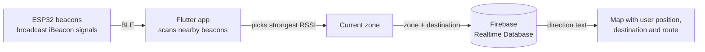

# Pasar Payang Indoor Navigation

A Flutter mobile app that helps visitors find their way around **Pasar Payang**, a busy indoor market in Kuala Terengganu, using **ESP32 Bluetooth Low Energy (BLE) iBeacons** and **Firebase Realtime Database**.

> Final Year Project, Bachelor of Computer Science (Hons.) Computer Networking, Universiti Teknologi MARA (UiTM), 2025.

## The problem

GPS doesn't work well indoors. In a large, crowded market with many similar-looking stalls, visitors often struggle to find a particular section, such as food, souvenirs or jewellery. This project uses low-cost BLE beacons to detect which zone the user is in and to guide them to the zone they want.

## How it works



1. An **ESP32** in each zone of the market broadcasts an iBeacon signal with its own `minor` ID.
2. The app scans for BLE advertisements and **parses the raw iBeacon manufacturer data** (the `0x02 0x15` prefix, then the major and minor values).
3. The beacon with the **strongest signal (RSSI)** is taken as the user's current zone.
4. The app looks up the **direction** from the current zone to the chosen destination in Firebase Realtime Database.
5. The market map shows the user's position, the destination and the direction to take.

### Zones

| Beacon minor | Zone |
|---|---|
| 101 | Food Zone |
| 102 | Souvenir Zone |
| 103 | Jewellery Zone |

## Features

- **Email/password login and sign-up** with Firebase Authentication, plus an auth gate that keeps users signed in
- **Real-time BLE beacon scanning** with runtime Bluetooth and location permission handling
- **Zone detection** using the nearest beacon (strongest RSSI)
- **Turn-by-turn direction text** loaded from Firebase Realtime Database
- **Interactive market map** marking the user's position and the destination

## Tech stack

| Layer | Technology |
|---|---|
| Mobile app | Flutter (Dart) |
| Hardware | ESP32 (BLE iBeacon) |
| Authentication | Firebase Authentication |
| Database | Firebase Realtime Database |
| BLE scanning | `flutter_blue_plus` |
| Permissions | `permission_handler` |

## Firebase data structure

```json
{
  "zones": {
    "101": {
      "name": "Food Zone",
      "direction_to": {
        "102": "Walk straight ahead, then turn right at the souvenir stalls.",
        "103": "..."
      }
    },
    "102": { "name": "Souvenir Zone", "direction_to": { "...": "..." } },
    "103": { "name": "Jewellery Zone", "direction_to": { "...": "..." } }
  }
}
```

*(Direction text above is only an example.)*

## Source files

This repository contains the main source files of the app:

| File | Purpose |
|---|---|
| `main.dart` | App entry point, Firebase setup, theme and auth gate |
| `auth_screen.dart` | Login and sign-up screen |
| `home_page.dart` | Home screen with bottom navigation and the beacon scan button |
| `beacon_scanner_page.dart` | BLE scanning, iBeacon parsing, zone detection and map view |
| `category_page.dart`, `notification_page.dart` | Placeholder screens for future features |
| `AndroidManifest.xml` | Bluetooth and location permissions |
| `pubspec.yaml` | Dependencies |

## Running the app

1. Create a Flutter project and copy the `.dart` files into `lib/`.
2. Add the dependencies from `pubspec.yaml` and put `logo.png` and `pasar_map.png` in `lib/assets/`.
3. Create a Firebase project, turn on **Email/Password Authentication** and **Realtime Database**, and add your own `google-services.json` to `android/app/`.
4. Add the Bluetooth and location permissions from `AndroidManifest.xml`.
5. Set up ESP32 boards to broadcast iBeacons with minor IDs `101`, `102` and `103`.
6. Run on a **physical Android device**, because the emulator can't scan for BLE:
   ```bash
   flutter pub get
   flutter run
   ```

## Limitations and future work

- Choosing the nearest beacon by RSSI is simple but can jump between zones when signals are close. Smoothing RSSI (for example, with a moving average or Kalman filter) or using trilateration would make it more stable.
- The prototype covers three zones. Covering the whole market would need more beacons and a larger map.
- The Category and Notification screens are placeholders. Planned additions include a stall directory and promotions from traders.
- Routes are currently stored as text. A future version could calculate paths on a graph of the market layout.

## Author

**Nur Aqila Saffia binti Suhardi**
[LinkedIn](https://www.linkedin.com/in/aqilasaffia)
